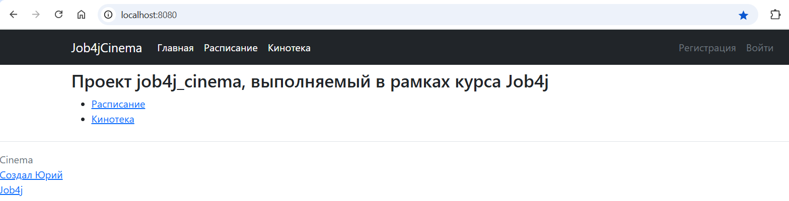
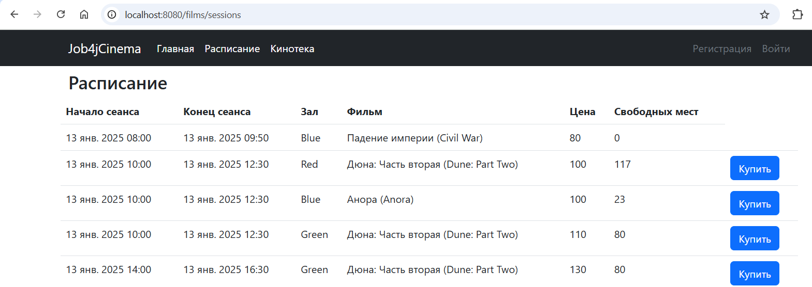
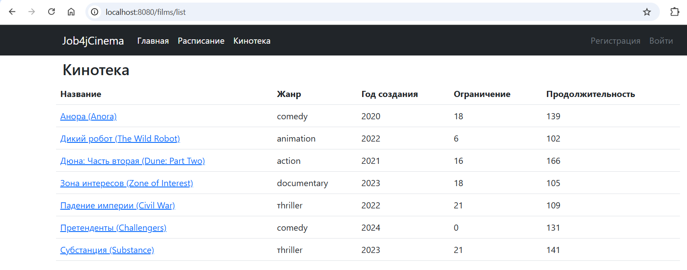
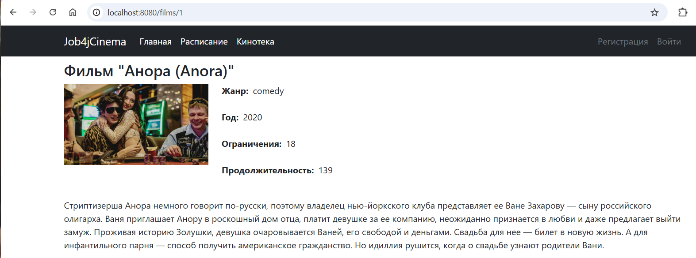
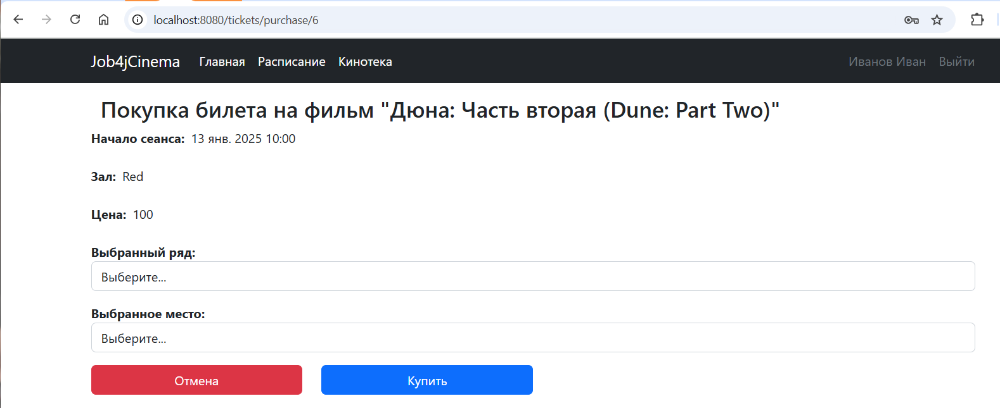
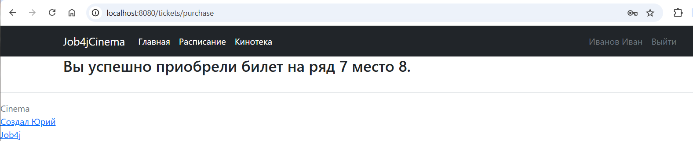
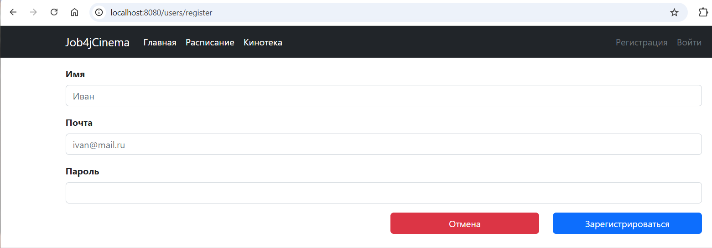
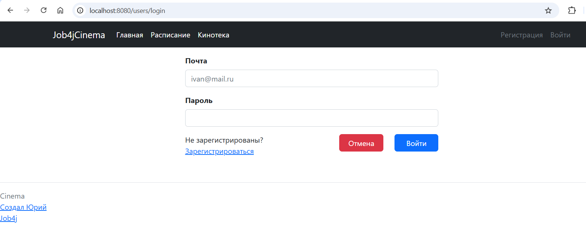

# job4j_cinema
Сайт по покупке билетов в кинотеатр.
Позволяет просмотреть список фильмов, расписание сеансов, приобрести билет.
Покупка билетов доступна только для зарегистрированных пользователей.
Если на выбранные сеанс и место билет уже продан, то продажа билета не производится. 

Стек технологий:
Java 19
PostgreSQL 16.2
Spring Boot 2.7.6
Maven 3.9.6
Liquibase Maven Plugin 4.15.0
JaCoCo Maven Plugin 0.8.8
SQL2O 1.6.0

Запуск проекта:
Выполнить метод main в классе Main

Взаимодействие с приложением:

Главная страница

Расписание

Кинотека

Страница описания фильма

Страница покупки билета

Страница с результатом успешной покупки билета

Страница с результатом неудачной покупки билета

Страница регистрации

Страница аутентификации

Контакты
https://github.com/GitHubfilipich